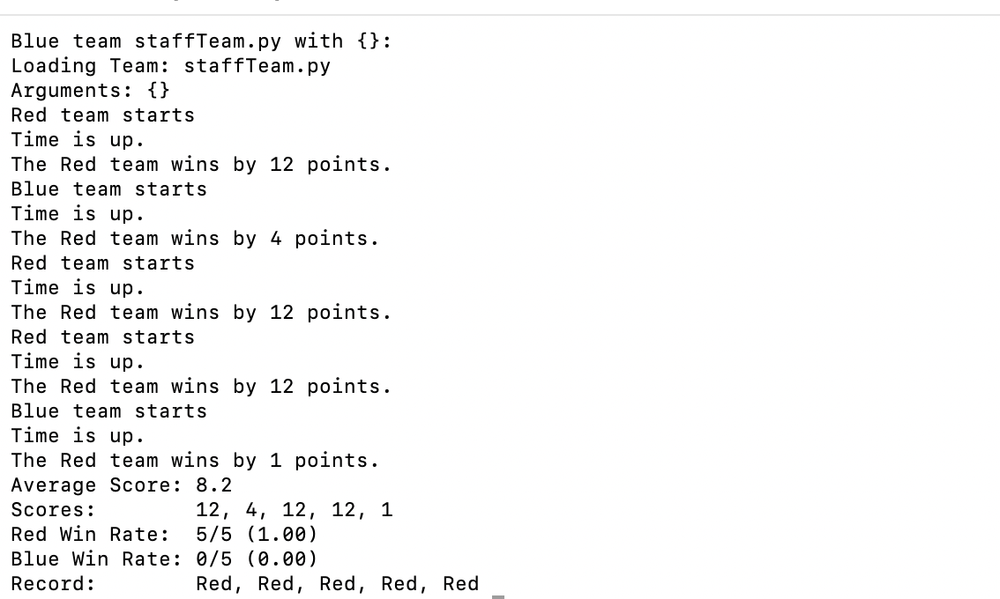

# Pacman Q-Learning Agent 🎮

This repository contains a **Q-Learning based AI agent** for the *Pacman Capture-the-Flag* environment, developed as part of Monash University's FIT5222 coursework.

## 🧠 Overview

The agent learns to capture food and defend its home territory using **Reinforcement Learning (Q-Learning)**.  
It balances exploration and exploitation through an ε-greedy policy and uses handcrafted features to make strategic decisions in a multi-agent environment.

## ⚙️ Techniques

- Reinforcement Learning (Q-Learning)
- Feature Extraction and State Evaluation
- Multi-Agent Game AI
- Python (3.8+)

## 🧩 Files

| File | Description |
|------|-------------|
| `myTeam.py` | Main Q-Learning agent implementation |
| `QLWeights.json` | Pre-trained weights (optional) |
| `capture.py` | Game environment (from FIT5222 baseline) |

## 🚀 Run Locally

```bash
python capture.py -r myTeam.py -b staffTeam.py -n 10
```

## 🖼️ Demo Result

Example test run on map `RANDOM17` (local execution):

```
Red team wins by 12 points.
Red team wins by 4 points.
Red team wins by 12 points.
Red team wins by 12 points.
Red team wins by 1 point.

Average Score: +8.2
Red Win Rate: 5/5 (100%)
Blue Win Rate: 0/5 (0%)
```



The trained Q-learning agent consistently outperforms the baseline team across random maps, demonstrating adaptive decision-making.

## 👤 Author

**Jili Chen** — Master of IT (Artificial Intelligence), Monash University  
📧 jche0572@student.monash.edu


